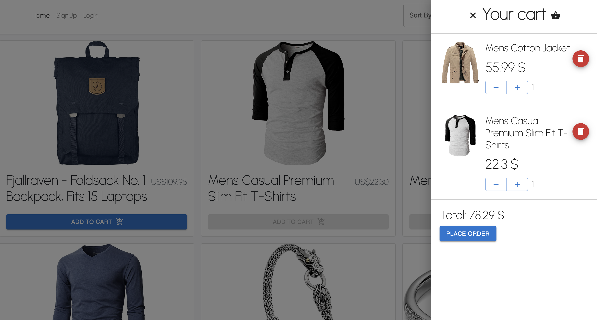
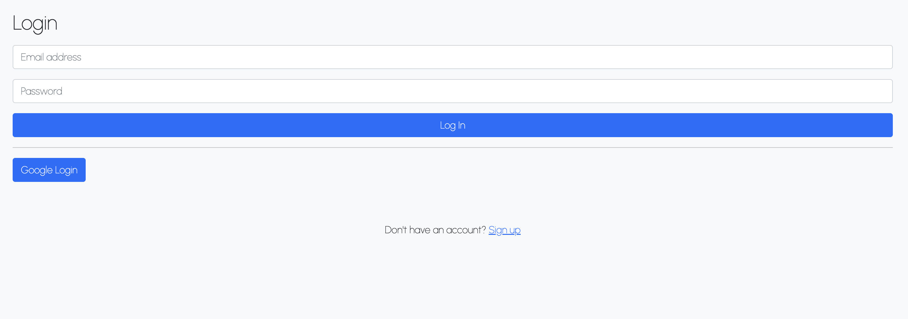
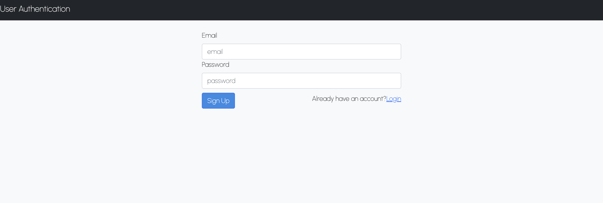
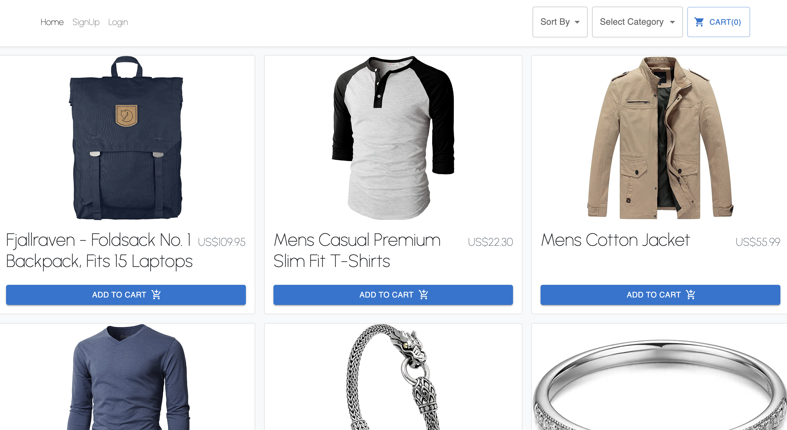
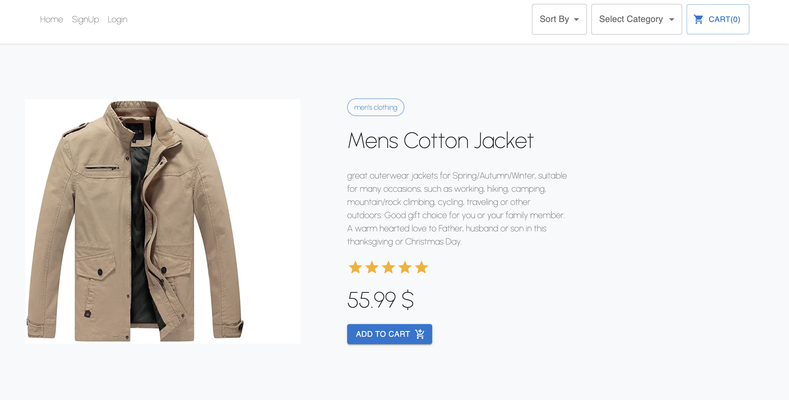

# 🛍️E-commerce Shop

> E-commerce project built with React and TypeScript.

> API used for this project [_here_](https://fakestoreapi.com/).

## Table of Contents

- [General Info](#general-information)
- [Technologies Used](#technologies-used)
- [Features](#features)
- [Screenshots](#screenshots)
- [Setup](#setup)
- [Project Status](#project-status)
- [Contact](#contact)

## General Information

E-commerce shop with different types of products. Wide range of filtering items functionality.

## Technologies Used

- React - version 18.1.0
- Redux - version 4.2.0
- React-redux - version 8.0.2
- TypeScript - version 4.7.4
- Axios - version 0.27.2
- Bootstrap - version 5.1.3
- React-bootstrap - version 2.4.0
- Webpack - version 5.72.0
- Firebase - version 9.8.3
- Prettier - version 2.6.2
- Material UI - version 5.8.7

## Features

Main features of the app:

- Log In, Google Login
- Sign Up
- Filtering products by multiple categories
- Sort by price
- Sort by alphabetically
- Product page
- Cart slider
- Adding products to cart
- Increasing, decreasing count of product with auto calculating total sum of order
- Removing products from cart

## Screenshots







## Setup

Run application in development environment:

```
npm install
npm start
```

Create production build:

```
npm run build
```

## Project Status

Project is: _completed_
